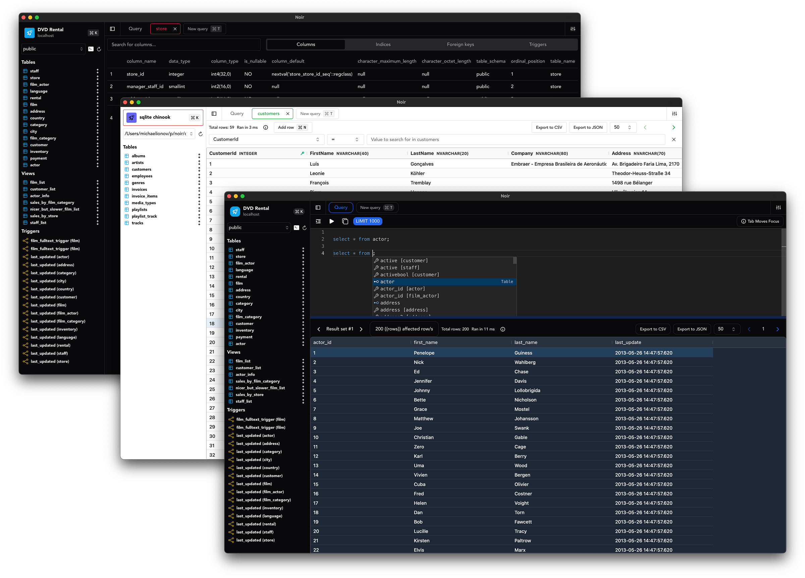

  

  <h1 align="center">Noir</h1>

  

    Unleash the Power of Seamless Database Management – Navigate, Query, and Optimize, All at Your Fingertips
     
     
    <a href="https://noirdb.dev/"><strong>Explore the docs »</strong></a>
     
     
    <a href="https://github.com/invm/noir/issues">Report a Bug</a>
    .
    <a href="https://github.com/invm/noir/issues">Request a Feature</a>
  

    

## Table Of Contents

- [Table Of Contents](#table-of-contents)
- [About The Project](#about-the-project)
  - [Supported databases](#supported-databases)
- [Built With](#built-with)
- [Getting Started](#getting-started)
  - [Prerequisites](#prerequisites)
  - [Installation](#installation)
- [Usage](#usage)
- [Contributing](#contributing)
  - [Creating A Pull Request](#creating-a-pull-request)
- [License](#license)
- [Authors](#authors)

## About The Project

Empower your database management experience with our keyboard-driven client! Free and open source, cross-platform, and designed for power developers.

Enjoy multiple connections, query tabs, export options, a sleek editor, and a lightning-fast grid – all accessible with the ease of keyboard shortcuts. 

Unleash efficiency, tailor UI themes, and explore complex data effortlessly. Elevate your workflow with quick actions, making it the ultimate choice for developers.

### Supported databases

- Postgresql
- MySQL
- MariaDB
- SQLite

## Built With

- Tauri
- SolidJS
- CodeMirror
- AG-Grid
- DaisyUI

Full lists are available under `package.json` and `src-tauri/Cargo.toml`.

## Getting Started

If you want to contribute or build for your arch that is not listed on the release page, you may clone this repo and run or build as you like. 

### Prerequisites

- [Rust](https://rustup.rs/)
- [Node](https://nodejs.org/en)
- [pnpm](https://pnpm.io/installation)

### Installation

Run `pnpm install`

Start the project with `pnpm dev`

Build for your os and arch with `pnpm tauri build`

## Usage

Query, inspect, and export results all with your keyboard.

Noir is a database management client and you can do everything you would expect with it, full docs are available [here](https://noirdb.dev/).

## Contributing

Contributions are what make the open source community such an amazing place to be learn, inspire, and create. Any contributions you make are **greatly appreciated**.
* If you have suggestions for adding or removing projects, feel free to [open an issue](https://github.com/invm/noir/issues/new) to discuss it, or directly create a pull request after you edit the *README.md* file with necessary changes.
* Please make sure you check your spelling and grammar.
* Create individual PR for each suggestion.

### Creating A Pull Request

1. Fork the Project
2. Create your Feature Branch (`git checkout -b feature/AmazingFeature`)
3. Commit your Changes (`git commit -m 'Add some AmazingFeature'`)
4. Push to the Branch (`git push origin feature/AmazingFeature`)
5. Open a Pull Request

## License

Distributed under the GPLv3 license.
See [LICENSE](LICENSE.md) for more information.

## Authors

* [Michael Ionov](https://github.com/invm/)

This readme was made with [Readme generator](https://readme.shaankhan.dev/)
